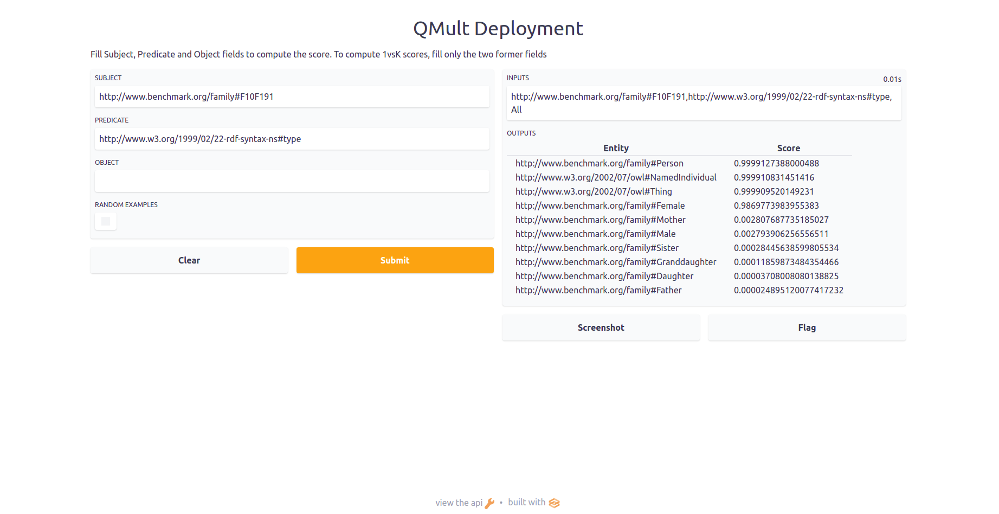

# DICE Embeddings: Hardware-agnostic Framework for Large-scale Knowledge Graph Embeddings

Knowledge graph embedding research has mainly focused on learning continuous representations of knowledge graphs towards the link prediction problem. 
Recently developed frameworks can be effectively applied in a wide range of research-related applications.
Yet, using these frameworks in real-world applications becomes more challenging as the size of the knowledge graph grows.

We developed the DICE Embeddings framework to compute embeddings for large-scale knowledge graphs in a hardware-agnostic manner.
To achieve this goal, we rely on
1. [Pandas](https://pandas.pydata.org/) to use parallelism at preprocessing a large knowledge graph,
2. [PyTorch](https://pytorch.org/) & [PytorchLightning](https://www.pytorchlightning.ai/) to learn knowledge graph embeddings via multi-CPUs, GPUs, TPUs or computing cluster, and
3. [Gradio](https://gradio.app/) to ease the deployment of pre-trained models.

**Why [Pandas](https://pandas.pydata.org/) & Co. ?**
Pandas allows us to read, preprocess (e.g. removing literals) and index an input knowledge graph in parallel.
Through parquet within pandas, a billion of triples can be read in parallel fashion. 
Importantly, using frameworks based on Pandas (modin, vaex or polars) allow us to perform all necessary computations on a single CPU as well as a cluster of computers.

**Why [PyTorch](https://pytorch.org/) & [PytorchLightning](https://www.pytorchlightning.ai/) ?**
PyTorch is one of the most popular machine learning frameworks available at the time of writing. 
PytorchLightning facilitates scaling the training procedure of PyTorch without boilerplate.
In our framework, we combine [PyTorch](https://pytorch.org/) & [PytorchLightning](https://www.pytorchlightning.ai/).
By this, we are able to train large knowledge graph embedding models with billions of parameters.
PytorchLightning allows us to use state-of-the-art model parallelism techniques (e.g. Fully Sharded Training, FairScale, or DeepSpeed)
without extra effort.
With our framework, practitioners can directly use PytorchLightning for model parallelism to train gigantic embedding models.

**Why [Hugging-face Gradio](https://huggingface.co/gradio)?**
Deploy a pre-trained embedding model without writing a single line of code.

## Installation
Clone the repository:
```
git clone https://github.com/dice-group/dice-embeddings.git
```
To install dependencies:
```
# python=3.10 with torch cuda nncl https://discuss.pytorch.org/t/issues-on-using-nn-dataparallel-with-python-3-10-and-pytorch-1-11/146745/13
conda create -n dice python=3.9.12
conda activate dice
# Choose a backend
pip3 install pandas==1.5.1 modin==0.16.2 vaex==4.14.0 polars==0.14.26 
pip3 install torch==1.13.0 
pip3 install pytorch-lightning==1.6.4
pip3 install scikit-learn==1.1.1
pip3 install pytest==6.2.5
pip3 install gradio==3.0.17
pip3 install pyarrow==8.0.0
```
To test the Installation
```
wget https://hobbitdata.informatik.uni-leipzig.de/KG/KGs.zip
unzip KGs.zip
pytest -p no:warnings -x # it takes circa 15 minutes
pytest -p no:warnings --lf # run only the last failed test
pytest -p no:warnings --ff # to run the failures first and then the rest of the tests.
```
## Pre-trained Models
Please contact:  ```caglar.demir@upb.de ``` or ```caglardemir8@gmail.com ``` , if you lack hardware resources to obtain embeddings of a specific knowledge Graph.
- [DBpedia version: 06-2022 Embeddings](https://hobbitdata.informatik.uni-leipzig.de/KGE/DBpediaQMultEmbeddings_03_07):
  - Models: ConEx, QMult
- [YAGO3-10 ConEx embeddings](https://hobbitdata.informatik.uni-leipzig.de/KGE/conex/YAGO3-10.zip)
- [FB15K-237 ConEx embeddings](https://hobbitdata.informatik.uni-leipzig.de/KGE/conex/FB15K-237.zip)
- [WN18RR ConEx embeddings](https://hobbitdata.informatik.uni-leipzig.de/KGE/conex/WN18RR.zip)
- For more please look at [Hobbit Data](https://hobbitdata.informatik.uni-leipzig.de/KGE/)

## Examples 
> How to use the framework:`documents/using_dice_embedding_framework`.

> Training different strategies: `documents/training_techniques`.

## Using Pre-trained ConEx on DBpedia 03-2022
```bash
# To download a pretrained ConEx
mkdir ConEx && cd ConEx && wget -r -nd -np https://hobbitdata.informatik.uni-leipzig.de/KGE/DBpedia/ConEx/ && cd ..
```
### Triple Classification
```python
from core import KGE
pre_trained_kge = KGE(path_of_pretrained_model_dir='ConEx')
 
pre_trained_kge.triple_score(head_entity=["http://dbpedia.org/resource/Albert_Einstein"],relation=["http://dbpedia.org/ontology/birthPlace"],tail_entity=["http://dbpedia.org/resource/Ulm"]) # tensor([0.9309])
pre_trained_kge.triple_score(head_entity=["http://dbpedia.org/resource/Albert_Einstein"],relation=["http://dbpedia.org/ontology/birthPlace"],tail_entity=["http://dbpedia.org/resource/German_Empire"]) # tensor([0.9981])
pre_trained_kge.triple_score(head_entity=["http://dbpedia.org/resource/Albert_Einstein"],relation=["http://dbpedia.org/ontology/birthPlace"],tail_entity=["http://dbpedia.org/resource/Kingdom_of_Württemberg"]) # tensor([0.9994])
pre_trained_kge.triple_score(head_entity=["http://dbpedia.org/resource/Albert_Einstein"],relation=["http://dbpedia.org/ontology/birthPlace"],tail_entity=["http://dbpedia.org/resource/Germany"]) # tensor([0.9498])
pre_trained_kge.triple_score(head_entity=["http://dbpedia.org/resource/Albert_Einstein"],relation=["http://dbpedia.org/ontology/birthPlace"],tail_entity=["http://dbpedia.org/resource/France"]) # very low
pre_trained_kge.triple_score(head_entity=["http://dbpedia.org/resource/Albert_Einstein"],relation=["http://dbpedia.org/ontology/birthPlace"],tail_entity=["http://dbpedia.org/resource/Italy"]) # very low
```
### Relation Prediction
```python
from core import KGE
pre_trained_kge = KGE(path_of_pretrained_model_dir='ConEx')
pre_trained_kge.predict_topk(head_entity=["http://dbpedia.org/resource/Albert_Einstein"],tail_entity=["http://dbpedia.org/resource/Ulm"])
```

### Entity Prediction
```python
from core import KGE
pre_trained_kge = KGE(path_of_pretrained_model_dir='ConEx')
pre_trained_kge.predict_topk(head_entity=["http://dbpedia.org/resource/Albert_Einstein"],relation=["http://dbpedia.org/ontology/birthPlace"]) 
pre_trained_kge.predict_topk(relation=["http://dbpedia.org/ontology/birthPlace"],tail_entity=["http://dbpedia.org/resource/Albert_Einstein"]) 
```

### Knowledge Graph Completion
```python
from core import KGE
pre_trained_kge = KGE(path_of_pretrained_model_dir='ConEx')
missing_triples = pre_trained_kge.find_missing_triples(confidence=0.95)
```

## How to Deploy
Any pretrained model can be deployed with an ease. Moreover, anyone on the internet can use the pretrained model with ```--share``` parameter.
```
python deploy.py --path_of_experiment_folder 'ConEx' --share True
Loading Model...
Model is loaded!
Running on local URL:  http://127.0.0.1:7860/
Running on public URL: https://54886.gradio.app

This share link expires in 72 hours. For free permanent hosting, check out Spaces (https://huggingface.co/spaces)
```

### Documentation
In documents folder, we explained many details about knowledge graphs, knowledge graph embeddings, training strategies and many more background knowledge.
We continuously work on documenting each and every step to increase the readability of our code.
## How to cite
Currently, we are working on our manuscript describing our framework. 
If you really like our work and want to cite it now, feel free to chose one :) 
```
# DICE Embedding Framework
@article{demir2022hardware,
  title={Hardware-agnostic computation for large-scale knowledge graph embeddings},
  author={Demir, Caglar and Ngomo, Axel-Cyrille Ngonga},
  journal={Software Impacts},
  year={2022},
  publisher={Elsevier}
}
# KronE
@article{demir2022kronecker,
  title={Kronecker Decomposition for Knowledge Graph Embeddings},
  author={Demir, Caglar and Lienen, Julian and Ngomo, Axel-Cyrille Ngonga},
  journal={arXiv preprint arXiv:2205.06560},
  year={2022}
}
# QMult, OMult, ConvQ, ConvO
@InProceedings{pmlr-v157-demir21a,
  title = 	 {Convolutional Hypercomplex Embeddings for Link Prediction},
  author =       {Demir, Caglar and Moussallem, Diego and Heindorf, Stefan and Ngonga Ngomo, Axel-Cyrille},
  booktitle = 	 {Proceedings of The 13th Asian Conference on Machine Learning},
  pages = 	 {656--671},
  year = 	 {2021},
  editor = 	 {Balasubramanian, Vineeth N. and Tsang, Ivor},
  volume = 	 {157},
  series = 	 {Proceedings of Machine Learning Research},
  month = 	 {17--19 Nov},
  publisher =    {PMLR},
  pdf = 	 {https://proceedings.mlr.press/v157/demir21a/demir21a.pdf},
  url = 	 {https://proceedings.mlr.press/v157/demir21a.html},
}
# ConEx
@inproceedings{demir2021convolutional,
title={Convolutional Complex Knowledge Graph Embeddings},
author={Caglar Demir and Axel-Cyrille Ngonga Ngomo},
booktitle={Eighteenth Extended Semantic Web Conference - Research Track},
year={2021},
url={https://openreview.net/forum?id=6T45-4TFqaX}}
# Shallom
@inproceedings{demir2021shallow,
  title={A shallow neural model for relation prediction},
  author={Demir, Caglar and Moussallem, Diego and Ngomo, Axel-Cyrille Ngonga},
  booktitle={2021 IEEE 15th International Conference on Semantic Computing (ICSC)},
  pages={179--182},
  year={2021},
  organization={IEEE}
```
For any questions or wishes, please contact:  ```caglar.demir@upb.de``` or ```caglardemir8@gmail.com```

